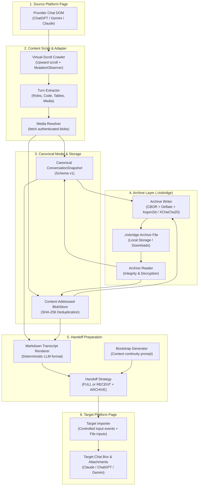

# System Architecture & Data Flow — ContextBridge

ContextBridge provides seamless, local-first conversation handoff between AI chat applications.

---

## 1. End-to-End Data Flow

### Step 1: Capture Phase
1. The user activates the ContextBridge extension popup on an active AI conversation.
2. The popup communicates with the page's content script (`entrypoints/<platform>.content.ts`).
3. The platform adapter (`ChatGPTAdapter`, `GeminiAdapter`, or `ClaudeAdapter`) identifies the conversation container.
4. The virtual-history crawler steps upward through the scroll container, awaiting `MutationObserver` notifications and harvesting rendered messages into an in-memory map.
5. Turns are parsed into canonical `Message` records with typed `ContentPart` items (markdown, code with language, tables, citations, images, and attachments).
6. Referenced media assets (images, uploaded PDFs, data URLs) are resolved with the user's active session authentication and stored into the content-addressed `BlobStore`.
7. Chronological sequence numbers are assigned.

### Step 2: Archive Serialization Phase
1. `buildArchive()` validates the canonical model against upper memory bounds.
2. An `ArchiveManifest` and the `ConversationSnapshot` are encoded into compact binary CBOR (RFC 8949) records.
3. Content-addressed binary blobs are stored with their cryptographic SHA-256 hashes and metadata.
4. The payload is compressed with native `CompressionStream('deflate-raw')`.
5. If password protection is requested, the payload is encrypted using libsodium Argon2id key derivation and XChaCha20-Poly1305 SecretStream encryption.
6. The archive file (`.ctxbridge`) is downloaded to the user's machine.

### Step 3: The Copied Chat ("tray")
1. A finished capture goes from the content script to the background over a `runtime.connect` port and is stored as the tray (`src/storage/tray-store.ts`): `storage.session` when it fits, otherwise `storage.local`, which the background wipes on browser start.
2. Opening a `.ctxbridge` file (in a tab, since Firefox closes toolbar popups when a file picker opens) replaces the tray the same way.
3. The capture belongs to the tab: closing the popup does not lose it, and a reopened popup reads its state from `GET_PAGE_STATUS`.

### Step 4: Handoff Preparation Phase
1. `buildHandoff()` applies context-window aware strategies:
   - **RECENT + ARCHIVE (Default):** The full conversation is rendered as `transcript.md` and attached, while the most recent messages go inline.
   - **FULL:** The entire transcript is inline (used by **Copy as text**).
2. A deterministic bootstrap prompt tells the target model to treat the material as prior conversation history and ends with what to do now (answer an open question, or confirm and wait).
3. `buildWireHandoff()` keeps only what the target needs (prompt, files as base64, counts).

### Step 5: Continuation Injection Phase
1. **Paste into this chat:** the popup sends `INJECT_HANDOFF` (`mode: 'background'`) to the tab and closes; the content script inserts once the page has focus again.
2. **Start a new chat in X:** the background opens the target site and records a small pending entry for that tab; the target content script claims it with `CLAIM_PENDING_HANDOFF` once its page is ready (a reload after signing in claims it again, for up to 10 minutes).
3. The composer importer inserts the prompt with `execCommand('insertText')` (DOM fallback) and verifies it. It then offers the files through the page's file input, a paste, and a drop, in that order, and stops at the first way after which the page shows them (a chip with the file name or a preview picture). Files the page does not show are reported as not confirmed, never as attached. At most the target's per-message file limit is sent (Gemini 10, ChatGPT 10, Claude 20, transcript.md included), newest files first; the rest are listed for the next message.
4. An in-page notice (closed shadow root) reports what was added and what needs attention; the outcome is also stored for the popup. The message stays a draft until the user presses Send.

---

## 2. Privacy & Isolation Guarantees

- **No Intermediate Cloud:** All data flows entirely within browser extension memory and local disk.
- **Content Security Policy (CSP):** The extension does not connect to external servers or transmit conversations to third parties.
- **Untrusted Input Treatment:** All conversation content is processed as passive data structures, preventing script execution or privilege escalation.
